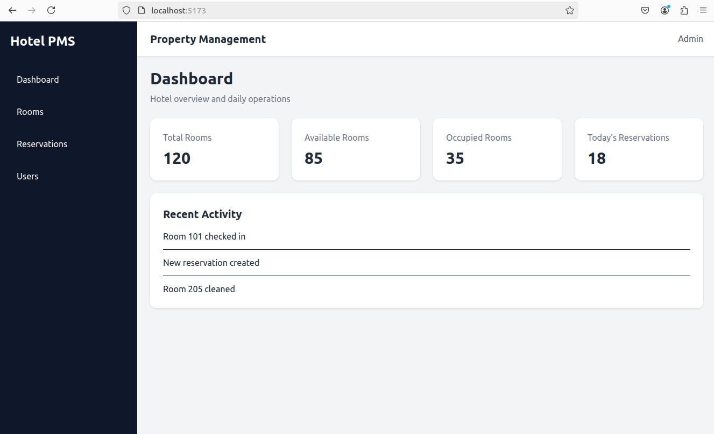
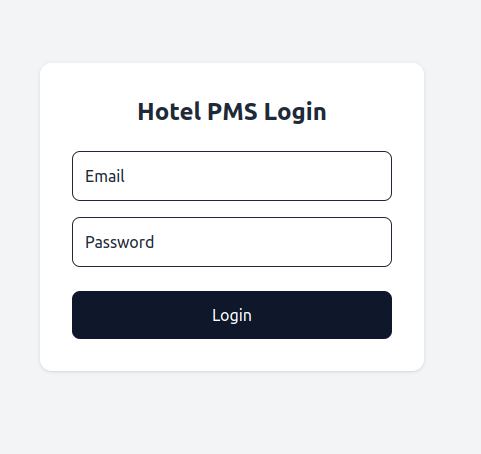
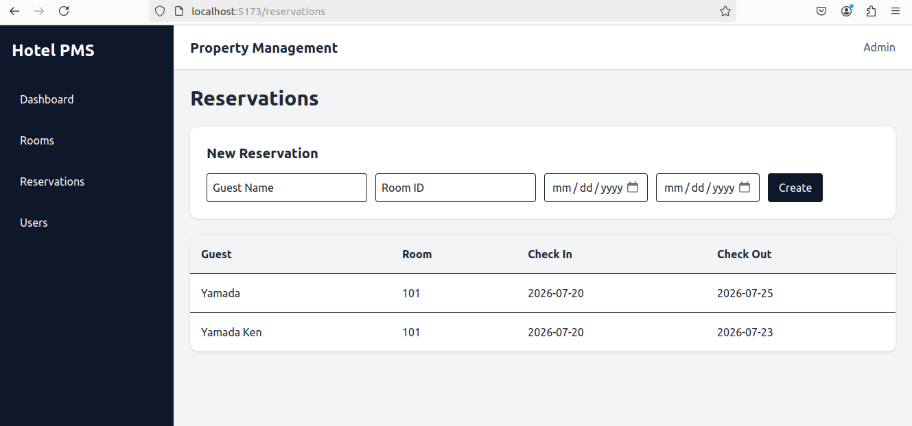

# Hotel Property Management System

A full-stack hotel property management system built with modern web technologies.

This application manages hotel operations including rooms, reservations, and users through a REST API architecture.

---

## 🚀 Tech Stack

### Backend

- NestJS
- TypeScript
- Prisma ORM
- PostgreSQL

### Frontend

- React
- TypeScript
- Vite
- Tailwind CSS
- Axios

### Development

- Ubuntu Linux
- Git
- Docker (planned)

---
# 🏨 Hotel Property Management System

## Screenshots

### Dashboard



### Login



### Room


### Reservation



## Architecture


---

# ✨ Features

## Room Management

- Create rooms
- View room list
- Manage room information

Example:
Room Number: 101
Type: Single
Price: 8000
Status: Available


---

## Reservation Management

- Create reservations
- View reservations
- Connect reservations with rooms

Example:
Guest:
Yamada Ken

Room:
101

Check-in:
2026-07-20

Check-out:
2026-07-23


---

## User Management

- User list
- User information management
- Role support

---

# 📡 API Endpoints

## Rooms

| Method | Endpoint | Description |
|---|---|---|
| GET | /rooms | Get all rooms |
| POST | /rooms | Create room |

---

## Reservations

| Method | Endpoint | Description |
|---|---|---|
| GET | /reservations | Get reservations |
| POST | /reservations | Create reservation |

---

## Users

| Method | Endpoint | Description |
|---|---|---|
| GET | /users | Get users |
| GET | /users/:id | Get user detail |

---

# 🗄 Database Design

Current models:
User

Room

Reservation

Payment


Relationship:


Room
|
| 1:N
|
Reservation
|
| 1:N
|
Payment

---

# ⚙️ Installation

## Backend

```bash
cd backend

npm install

npx prisma generate

npm run start:dev

## Frontend

cd frontend

npm install

npm run dev

🔐 Environment Variables

Backend:

DATABASE_URL=

Frontend:

VITE_API_URL=

👨💻 Author

JapanFullstackdev


License

MIT


Then:

```bash
git add README.md
git commit -m "Improve project documentation"
git push


